# AI Agent that generates bulk images using the LRO approach

An AI agent that generates multiple images using Google's Gemini AI (Reasoning) and Replicate's Flux (Image generator) model, with built-in human approval (HITL) (also called LRO (Long-Running Operations)) workflow for large batch orders.

## Overview

This agent demonstrates a **human-in-the-loop** pattern where AI operations requiring significant resources automatically pause for human approval before proceeding. Small image orders (≤4 images) execute immediately, while larger orders require explicit user confirmation.

## Key Features

- **Smart Approval Flow**: Only requests human approval when needed (bulk orders >4 images)
- **Resumable Workflows**: Can pause execution, get human feedback, and continue seamlessly
- **MCP Integration**: Uses MCP to connect with external image generation services
- **Session Persistence**: Maintains conversation state across approval cycles

## How It Works

### 1. **Small Orders (≤4 images)** - Immediate Execution

```
User Request → Agent → Generate Images → Done
```

No approval needed. The agent processes the request immediately.

### 2. **Large Orders (>4 images)** - Approval Required

```
User Request → Agent Checks Size → Pause for Approval → Human Decision → Continue or Stop
```

The agent pauses before consuming resources and waits for explicit user confirmation.

## Architecture Diagrams

### Workflow Decision Tree

```mermaid
flowchart TD
    A[User Requests N Images] --> B[Extract Size<br/>Call Bulk Approval Function]
    B --> C{Is N > 4 images?}
    C -->|NO| D[Approved ✓<br/>Proceed Immediately]
    C -->|YES| E[Pause & Request<br/>Human Approval]
    E --> F{User Response}
    F -->|Approve ✓| G[Generate Images<br/>in Batches of 4]
    F -->|Reject ✗| H[Stop<br/>No Images Generated]
    D --> G
    G --> I[Download & Save Images]
    
    style E fill:#fff3cd
    style F fill:#d1ecf1
    style H fill:#f8d7da
    style I fill:#d4edda
```



### Sequence Diagrams

#### Scenario A: Small Order (No Approval Needed)

```mermaid
sequenceDiagram
    participant User
    participant Agent
    participant BulkFunction as Bulk Approval Function
    participant ImageService as Image Generation Service
    
    User->>Agent: "Generate 3 images"
    Agent->>BulkFunction: bulk_check(size=3)
    BulkFunction-->>Agent: Approved ✓ (size ≤ 4)
    Agent->>ImageService: generate_image(num_outputs=3)
    ImageService-->>Agent: 3 Image URLs
    Agent-->>User: 3 Images delivered ✓
    
    Note over Agent,ImageService: No approval needed<br/>for small orders
```



#### Scenario B: Large Order (Approval Required - Approved)


#### Scenario C: Large Order (Approval Required - Rejected)


### System Architecture


## Prerequisites

1. **Environment Variables**:
   - `GOOGLE_API_KEY`: Your Google AI API key
   - `REPLICATE_API_TOKEN`: Your Replicate API token

2. **Node.js**: Required for the MCP image generation server

3. **Python Dependencies**: Install via `pip install -r requirements.txt`

## Usage

### Basic Usage

```python
# Auto-approve large orders
await run_image_generation_workflow(
    "Generate 6 images of cats",
    auto_approve=True
)

# Manual approval for large orders
await run_image_generation_workflow(
    "Generate 6 images of cats",
    auto_approve=False
)
```

### Configuration

- **Approval Threshold**: Change `LARGE_BULK = 4` to adjust when approval is required
- **Batch Size**: Flux-schnell model generates max 4 images per call (hardcoded by API)
- **Retry Logic**: Configured to retry on 429/500/503/504 errors with exponential backoff

## How the Agent Thinks

The agent follows a strict instruction set:

1. **Extract** the number of images from user request
2. **Call approval function** FIRST (mandatory check)
3. **Wait** if approval is pending
4. **Batch requests** if approved (4 images per API call)
5. **Stop** if rejected

This ensures no resources are consumed until explicitly authorized.

## Key Components

- **`generate_image_bulk()`**: Approval gate function
- **`ToolContext.request_confirmation()`**: Pauses execution for human input
- **`McpToolset`**: Connects to external image generation service
- **`ResumabilityConfig`**: Enables pause/resume capability
- **`InMemorySessionService`**: Maintains conversation state

## Example Output

```
============================================================
User > Generate 6 images of a cat
[DEBUG] generate_image_bulk called with bulk_size=6
[DEBUG] Requesting confirmation for bulk_size=6
⏸️  Pausing for approval...

📋 Approval Required:
   Order size exceeds threshold (4 images)
   Do you want to approve this order? (yes/no): yes
🤔 Human Decision: APPROVE ✅

[DEBUG] Function call after approval: generate_image
Agent > I've generated 6 images of cats for you.

🎨 Generated 6 images:
  ✅ Image 1 saved as 'generated_image_1.png'
  ✅ Image 2 saved as 'generated_image_2.png'
  ...
============================================================
```

Check the [generated image](generated_image_1.png).

## Why This Pattern Matters

- **Cost Control**: Prevents accidental large API bills
- **Resource Governance**: Humans control expensive operations
- **Audit Trail**: All approvals are logged and traceable
- **Compliance**: Required for many enterprise